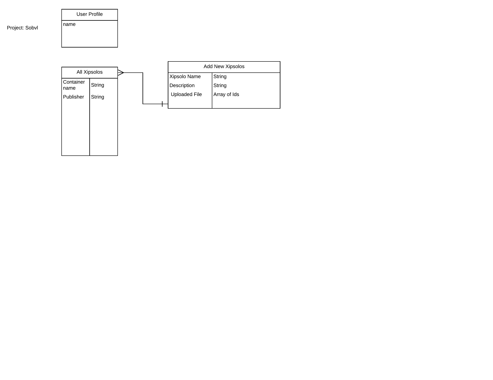

# SvySobvl

This project takes a common problem, not having a platform to sync and store voice memos, and provides an intuitive user friendly design to bring spontaneous ideas to life in a todo app.

### The technology implemented includes:
     
     * React
     *  AWS
     * Express
     * Node.js
     * MongoDb Atlas
     * Sass
     * Oauth 

Here is the ERD:

Here is a wireframe:

### Challenges: 

The files in this project were not added to a route due to some setbacks in terms of a timeline, I set up a solid structure to implement the upload feature later on.